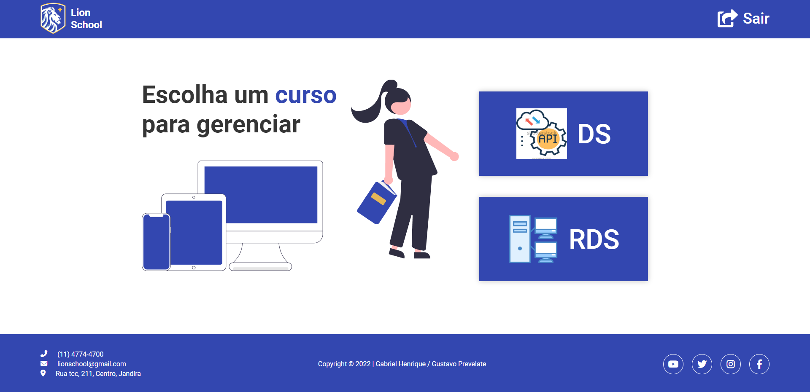

# Projeto LionSchool - Gabriel Henrique e Gustavo Prevelate 

---

# Portfólio

[Clique aqui](https://gustavoprevelate.github.io/Frontend-LionSchool-Gabriel-Gustavo/) para visitar o site.

---

## Sobre
Site da escola Lion school. O objetivo deste projeto é colocar em prática os conhecimentos adquiridos no curso do [SENAI Jandira](https://jandira.sp.senai.br/) na criação de web sites e adquirir conhecimento sobre outras coisas das quais não foram abordadas no curso.

---
## Tecnologias
- HTML
- CSS
- Responsividade
- JS
- JSON
- Postman

---
## Itens Adicionais

- Figma

[Clique aqui](https://www.figma.com/file/r4BhHJzzHDcv9LK333T2d5/LionSchool?node-id=0-1&t=fd15MEUdozzYvWnK-0) para visitar o Figma.

- Home

- Desenvolvimento

- Redes

- Aluno

---
## Relatórios do LightHouse
O LightHouse basicamente analisa todo o seu site, indicando como está determinados aspectos do mesmo. Segue o relatório:

- LightHouse Home

- LightHouse alunos

- LightHouse aluno

---
## Equipe

- [Gabriel Henrique](https://github.com/Gabriel0612205)

- [Gustavo Prevelate](https://github.com/GustavoPrevelate)

# Critérios de Avaliação
- [x] `Criou layout conforme designer feito no Figma?`
- [x] `Os botões dos cursos são dinâmicos?`
- [x] `Os cards são criados dinamicamente?`
- [x] `A página com informações dos cursos foi criada dinamicamente?`
- [x] `O filtro por status está funcional?`
- [x] `Os nomes das variáveis, funções e arquivos tem valor semântico?`
- [x] `A maioria das funções seguem as boas práticas como responsabilidade única?`
- [x] `Foi criado o layout responsivo no Figma?`
- [x] `Foi implementado a responsividade conforme planejado no Figma?`
- [x] `Foi criado o filtro por ano?`
